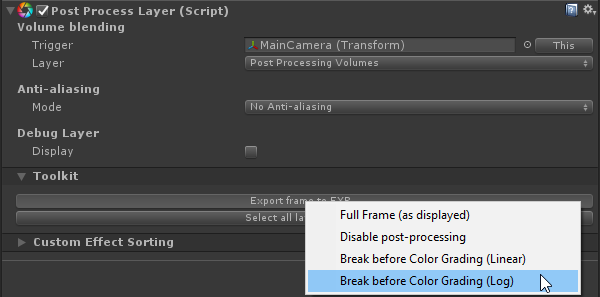

Please note that using Photoshop for grading isn't recommended as it only has very limited capabilities when it comes to 32bit editing.

### Step 1

Export the current frame in Log as EXR without color grading applied.

### Step 2

Open the previously exported EXR file in Photoshop. It should look like a Log footage.

### Step 3

Add a non-destructive color lookup adjustment layer to your image and use the `Unity Log To Linear` LUT that you'll find in `/PostProcessing/Textures/Cubes/`.

### Step 4

You can now start grading your image. Make sure you only do global color operation through the use of non-destructive adjustment layers. Local operators, filters or any effect that has an effect on neighbor pixels (e.g. blur) can't be stored in LUTs.

### Step 5

Once you're done, export a CUBE by going to `File -> Export -> Color Lookup Tables` and use the following settings:

Save the resulting file somewhere in your `Assets` folder.

### Step 6

Back in Unity, it will detect the CUBE and automatically convert it to a `Texture3D` asset. Grab this texture and populate the `Lookup Texture` field in the color grading effect.

And you're done. You can keep grading in Photoshop and override the previously saved CUBE file, Unity will automatically update the `Texture3D` used for real-time grading.

Volume blending with external LUTs is, of course, supported out-of-the-box.