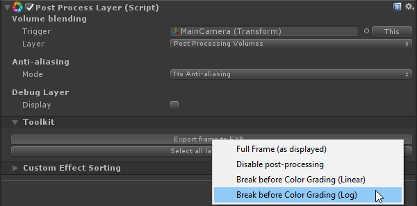
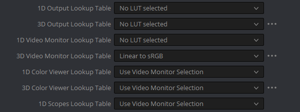
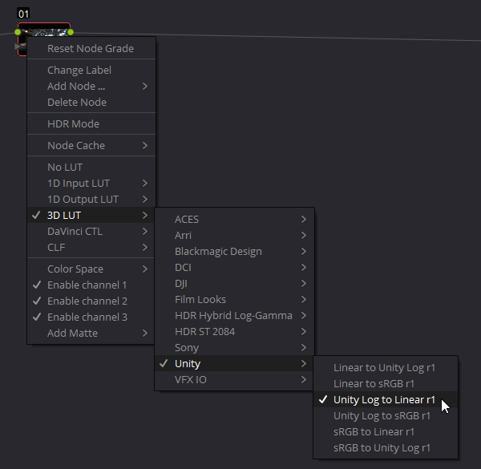
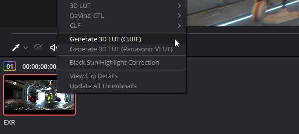
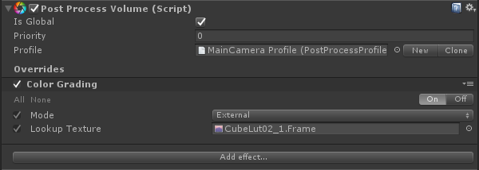

Before you can work in Resolve you'll need a one-time setup step: copy all the CUBE files from `/PostProcessing/Textures/Cubes/` to Resolve's LUT folder. You can find this folder by opening Resolve, going to `Project Settings -> Color Management` and clicking `Open LUT Folder`. We recommend you put them into a separate folder, say `Unity`, for easier access later on. Don't forget to click on `Update List` after you've copied the LUTs.

Let's go over the workflow to grade Unity scenes in Resolve.

### Step 1

Export the current frame in Log as EXR without color grading applied.

### Step 2

Open the previously exported EXR file in Resolve. It will look wrong, but that's expected. Resolve, by default, will display EXR files in linear mode. Go to `Project Settings -> Color Management` and set the `3D Video Monitor Lookup Table` to `Linear to sRGB`. The EXR should now look like a Log footage.

### Step 3

In the node view or the color editing panel, right-click the only color grading node there is and assign the `Unity Log To Linear` 3D LUT to it. It should now look exactly like it does in the Editor.

### Step 4

You can now start grading your image. Use as many node as you'd like to move between color spaces but make sure you only do global color operations. Local operators & filters can't be store in LUTs.

### Step 5

Once you're done, export a CUBE by right-clicking the clip and choosing `Generate 3D LUT (CUBE)`. Save the resulting file somewhere in your `Assets` folder.

### Step 6

Back in Unity, it will detect the CUBE and automatically convert it to a `Texture3D` asset. Grab this texture and populate the `Lookup Texture` field in the color grading effect.

And you're done. You can keep grading in Resolve and override the previously saved CUBE file, Unity will automatically update the `Texture3D` used for real-time grading.

Volume blending with external LUTs is, of course, supported out-of-the-box.