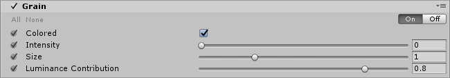

Film grain is the random optical texture of photographic film due to the presence of small particles of the metallic silver (or dye clouds for colored films) in the film stock.

The **Grain** effect is based on a coherent gradient noise. It is commonly used to emulate the apparent imperfections of film and often exaggerated in horror themed games.

> **TODO:** before/after screenshot

### Properties

| Property               | Function                                                     |
| :---------------------- | :------------------------------------------------------------ |
| Colored                | Enables the use of colored grain.                            |
| Intensity              | Grain strength. Higher means more visible grain.             |
| Size                   | Grain particle size.                                         |
| Luminance Contribution | Controls the noisiness response curve based on scene luminance. Lower values mean less noise in dark areas. |

### Performances

Disabling `Colored` will make the effect run faster.

### Requirements

- Shader Model 3

See the [Graphics Hardware Capabilities and Emulation](https://docs.unity3d.com/Manual/GraphicsEmulation.html) page for further details and a list of compliant hardware.