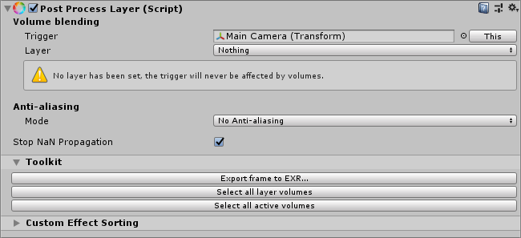
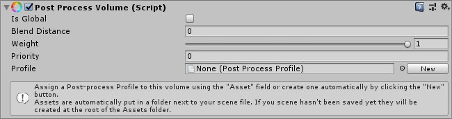
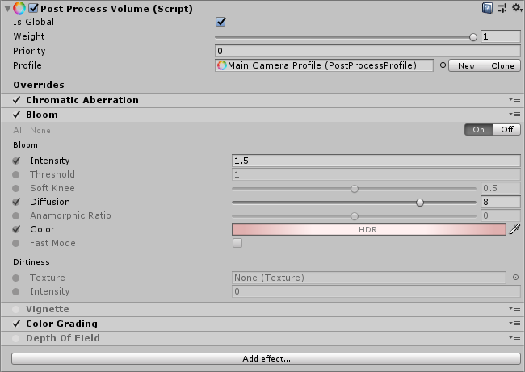

> **Note:** if you created a project using one of the template that includes Post-processing then you don't need to go through most of these steps although we recommend you read them to understand how everything works.

## Post-process Layer

The first thing you need to enable post-processing on a camera is to add the `Component -> Rendering -> Post-process Layer` component to it.

The first section describes **Volume blending** settings for this camera:

- **Trigger:** by default the camera itself will be assigned to it. This is transform that will be drive the volume blending feature. In some cases you may want to use a transform other than the camera, e.g. for a top down game you'll want the player character to drive the blending instead of the actual camera transform.
- **Layer:** a mask of layers to consider for volume blending. It allows you to do volume filtering and is especially useful to optimize volume traversal. You should always have your volumes in dedicated layers instead of the default one for best performances. By default it's set to `Nothing` so don't forget to change it or local volumes won't have any effect.

Next comes **Anti-aliasing** which has to be setup per-camera. The benefit of doing it that way instead of having a global setting in the project is that you can optimize your cameras to only use anti-aliasing when needed. For instance, your main camera could be using **Temporal Anti-aliasing** but a secondary one used to render a security camera would only require **FXAA**. More information about anti-aliasing is available on the [dedicated effect page](https://github.com/Unity-Technologies/PostProcessing/wiki/Anti-aliasing).

The **Stop NaN Propagation** toggle will kill any invalid / NaN pixel and replace it with a black color before post-processing is applied. It's generally a good idea to keep this enabled to avoid post-processing artifacts cause by broken data in the scene.

The **Toolkit** section comes with a few utilities. You can export the current frame to EXR using one of the following modes:

- **Full Frame (as displayed):** exports the camera as-is (if it's on the camera shown in the Game View, the export will look exactly like what's shown in the Game View).
- **Disable post-processing:** same as the previous mode but without any sort of post-processing applied.
- **Break before Color Grading (linear):** same as the first mode but will stop rendering just before **Color Grading** is applied. This is useful if you want to author grading LUTs in an external software.
- **Break before Color Grading (log):** same as the previous mode but the output will be log-encoded. This is used to author full-precision HDR grading LUTs in an external software.

Other utilities include:

- **Select all layer volumes:** selects all **Post-process Volume** components that can affect this **Post-process Layer**.
- **Select all active volumes:** selects all **Post-process Volume** components currently affecting this **Post-process Layer**.

Finally, the last section allows you to change the rendering order of custom effects. More information on [Writing Custom Effects](https://github.com/Unity-Technologies/PostProcessing/wiki/Writing-Custom-Effects).

## Post-process Volumes

The way post-processing works in this framework is by using local & global volumes. It allows you to give each volume a priority and a set of effect overrides to automatically blend post-processing settings in your scene. For instance, you could have a light vignette effect set-up globally but when the player enters a cave you would only override the `Intensity` setting of the vignette to make it stronger while keeping the rest of the settings intact.

The **Post-process Volume** component can be added to any game object, the camera itself included. But it's generally a good idea to create a dedicated object for each volume. Let's start by creating a global **Post-process Volume**. Create an empty game object and add the component to it (`Component -> Rendering -> Pöst-process Volume`) or use `GameObject -> 3D Object -> Post-process Volume`. Don't forget to add it to a layer that's being used by the mask set in the **Post-process Layer** component you added to your camera.

By default it's completely empty. Volumes come with two modes:

- **Global:** a global volume doesn't have any boundary and will be applied to the whole scene. You can of course have several of these in your scene.
- **Local:** a local volume needs a collider or trigger component attached to it to define its boundaries. Any type of 3D collider will work, from cubes to complex convex meshes but we recommend you use simple colliders as much as possible, as meshes can be quite expensive to traverse. Local volumes can also have a `Blend Distance` that represents the outer distance from the volume surface where blending will start.

In this case we want a global volume so let's enable `Is Global`.

`Weight` can be used to reduce the global contribution of the volume and all its overrides, with 0 being no contribution at all and 1 full contribution.

The `Priority` field defines the volume order in the stack. The higher this number is, the higher priority a volume has.

We also need a to create a profile for this volume (or re-use an existing one). Let's create one by clicking the `New` button (you can also use `Create -> Post-processing Profile` in your project window). It will be created as an asset file in your project. To edit a profile content you can either select this asset or go to a volume inspector where it will be replicated for easier access. Once a profile as been assigned you'll see a new button appear, `Clone`. This one will duplicate the currently assigned profile and set it on the volume automatically. This can be handy when you want to create quick variations of a same profile (although you should really use the override system if possible).

We can now start adding effect overrides to the stack.

The anatomy of an effect is as follow:

Each field has an override checkbox on its left, you'll need to toggle the settings you want to override for this volume before you can edit them. You can quickly toggle them all on or off by using the small `All` and `None` shortcuts at the top left.

The top-right `On/Off` toggle is used to override the active state of the effect itself in the stack (if you want, for instance, to force-disable an effect in a higher priority volume) whereas the toggle in the title bar is used to disable the set of overrides for this effect in this particular volume.

Finally, you can right-click and effect title to show a quick-action menu to copy/paste/remove/reset settings.