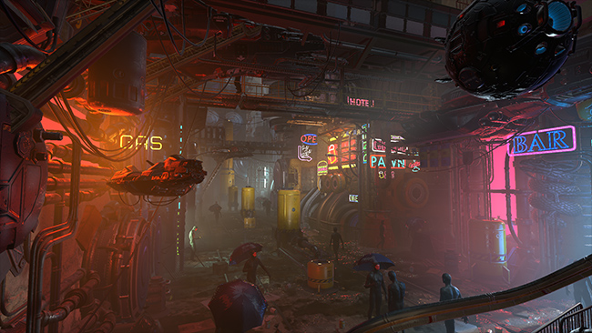
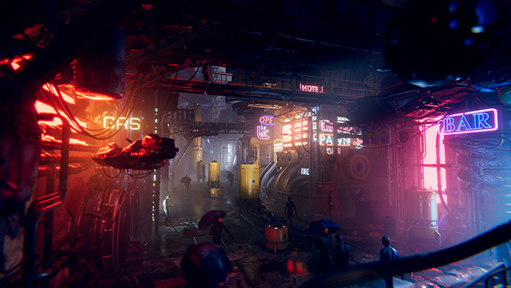

## Description

**Post-processing** is the process of applying full-screen filters and effects to a camera’s image buffer before it is displayed to screen. It can drastically improve the visuals of your product with little setup time.

You can use post-processing effects to simulate physical camera and film properties.

The images below demonstrate a scene with and without post-processing.

## Contents

* [Installation](https://github.com/Unity-Technologies/PostProcessing/wiki/Installation)
* [Quick-start](https://github.com/Unity-Technologies/PostProcessing/wiki/Quick-start)
* Effects
    - [Ambient Occlusion](https://github.com/Unity-Technologies/PostProcessing/wiki/Ambient-Occlusion)
    - [Anti-aliasing](https://github.com/Unity-Technologies/PostProcessing/wiki/Anti-aliasing)
    - [Auto-exposure](https://github.com/Unity-Technologies/PostProcessing/wiki/Auto-Exposure)
    - [Bloom](https://github.com/Unity-Technologies/PostProcessing/wiki/Bloom)
    - [Chromatic Aberration](https://github.com/Unity-Technologies/PostProcessing/wiki/Chromatic-Aberration)
    - [Color Grading](https://github.com/Unity-Technologies/PostProcessing/wiki/Color-Grading)
    - [Deferred Fog](https://github.com/Unity-Technologies/PostProcessing/wiki/Deferred-Fog)
    - [Depth of Field](https://github.com/Unity-Technologies/PostProcessing/wiki/Depth-of-Field)
    - [Grain](https://github.com/Unity-Technologies/PostProcessing/wiki/Grain)
    - [Lens Distortion](https://github.com/Unity-Technologies/PostProcessing/wiki/Lens-Distortion)
    - [Motion Blur](https://github.com/Unity-Technologies/PostProcessing/wiki/Motion-Blur)
    - [Screen-space reflections](https://github.com/Unity-Technologies/PostProcessing/wiki/Screen-space-Reflections)
    - [Vignette](https://github.com/Unity-Technologies/PostProcessing/wiki/Vignette)
* Scripting
  - [Manipulating the Stack](https://github.com/Unity-Technologies/PostProcessing/wiki/Manipulating-the-Stack)
  - [Writing Custom Effects](https://github.com/Unity-Technologies/PostProcessing/wiki/Writing-Custom-Effects)
* [Debugging](https://github.com/Unity-Technologies/PostProcessing/wiki/Debugging)
* [Troubleshooting](https://github.com/Unity-Technologies/PostProcessing/wiki/Troubleshooting)