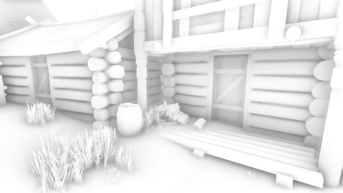
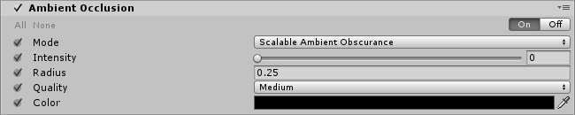
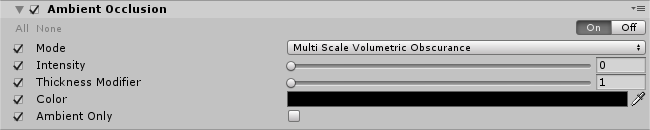

# Ambient Occlusion

The **Ambient Occlusion** post-processing effect approximates [Ambient Occlusion](http://en.wikipedia.org/wiki/Ambient_occlusion) in real time as a full-screen post-processing effect. It darkens creases, holes, intersections and surfaces that are close to each other. In real life, such areas tend to block out or occlude ambient light, hence they appear darker.

Note that the **Ambient Occlusion** effect is quite expensive in terms of processing time and generally should only be used on desktop or console hardware. Its cost depends purely on screen resolution and the effects parameters and does not depend on scene complexity as true ambient occlusion would.

The effect comes with two modes:

- Scalable Ambient Obscurance
- Multi-scale Volumetric Occlusion

## Scalable Ambient Obscurance

This is a standard implementation of ambient obscurance that works on non modern platforms. If you target a compute-enabled platform we recommend that you use the **Multi-scale Volumetric Occlusion** mode instead.

### Properties

| Property     | Function                                                     |
| :------------ | :------------------------------------------------------------ |
| Intensity    | Degree of darkness produced by the effect.                   |
| Radius       | Radius of sample points, which affects extent of darkened areas. |
| Quality      | Defines the number of sample points, which affects quality and performance. |
| Color        | Tint of the ambient occlusion.                               |
| Ambient Only | Enables the ambient-only mode in that the effect only affects ambient lighting. This mode is only available with the Deferred rendering path and HDR rendering. |

### Performances

Beware that this effect can be quite expensive, especially when viewed very close to the camera. For that reason it is recommended to favor a low `Radius` setting. With a low `Radius` the ambient occlusion effect will only sample pixels that are close, in clip space, to the source pixel, which is good for performance as they can be cached efficiently. With higher radiuses, the generated samples will be further away from the source pixel and won’t benefit from caching thus slowing down the effect. Because of the camera’s perspective, objects near the front plane will use larger radiuses than those far away, so computing the ambient occlusion pass for an object close to the camera will be slower than for an object further away that only occupies a few pixels on screen.

Dropping the `Quality` setting down will improve performances too.

Generally speaking, this effect should not be considered on mobile platforms and when running on consoles we recommend using the **Multi-scale Volumetric Occlusion** mode as it's much faster there and looks better in most cases.

### Requirements

- Depth & Normals textures
- Shader model 3

See the [Graphics Hardware Capabilities and Emulation](https://docs.unity3d.com/Manual/GraphicsEmulation.html) page for further details and a list of compliant hardware.

## Multi-scale Volumetric Occlusion

This is a more modern version of ambient occlusion heavily optimized for consoles and desktop platforms. It generally looks better and runs faster than the other mode on these platforms but requires compute shader support.

### Properties

| Property           | Function                                                     |
| :------------------ | :------------------------------------------------------------ |
| Intensity          | Degree of darkness produced by the effect.                   |
| Thickness Modifier | Modifies the thickness of occluders. This increases dark areas but can potentially introduces dark halos around objects. |
| Color              | Tint of the ambient occlusion.                               |
| Ambient Only       | Enables the ambient-only mode in that the effect only affects ambient lighting. This mode is only available with the Deferred rendering path and HDR rendering. |

### Requirements

- Compute shader support
- Shader model 4.5

See the [Graphics Hardware Capabilities and Emulation](https://docs.unity3d.com/Manual/GraphicsEmulation.html) page for further details and a list of compliant hardware.