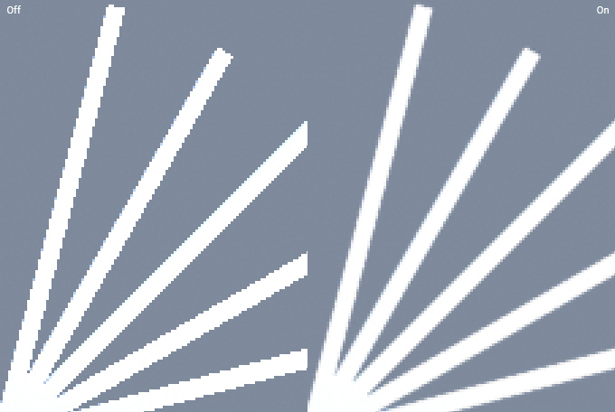

# Anti-aliasing

The **Anti-aliasing** effect offers a set of algorithms designed to prevent aliasing and give a smoother appearance to graphics. Aliasing is an effect where lines appear jagged or have a “staircase” appearance (as displayed in the left-hand image below). This can happen if the graphics output device does not have a high enough resolution to display a straight line.

**Anti-aliasing** reduces the prominence of these jagged lines by surrounding them with intermediate shades of color. Although this reduces the jagged appearance of the lines, it also makes them blurrier.

The Anti-aliasing algorithms are image-based. This is very useful when traditional multisampling (as used in the Editor’s [Quality settings](https://docs.unity3d.com/Manual/class-QualitySettings.html)) is not properly supported or when working with specular-heavy PBR materials.

The algorithms supplied in the post-processing stack are:

- Fast Approximate Anti-aliasing (FXAA)
- Subpixel Morphological Anti-aliasing (SMAA)
- Temporal Anti-aliasing (TAA)

They are set per-camera on the **Post-process Layer** component.

## Fast Approximate Anti-aliasing

**FXAA** is the cheapest technique and is recommended for mobile and other platforms that don’t support motion vectors, which are required for **TAA**.

### Properties

| Property   | Function                                                     |
| :--------- | :----------------------------------------------------------- |
| Fast Mode  | A slightly lower quality but faster variant of FXAA. Highly recommended on mobile platforms. |
| Keep Alpha | Toggle this on if you need to keep the alpha channel untouched by post-processing. Else it will use this channel to store internal data used to speed up and improve visual quality. |

### Performances

`Fast Mode` should be enabled on mobile & Nintendo Switch as it gives a substantial performance boost compared to the regular mode on these platforms. PS4 and Xbox One slightly benefit from it as well but on desktop GPUs it makes no difference and the regular mode should be used for added visual quality.

### Requirements

- Shader Model 3

See the [Graphics Hardware Capabilities and Emulation](https://docs.unity3d.com/Manual/GraphicsEmulation.html) page for further details and a list of compliant hardware.

## Subpixel Morphological Anti-aliasing

**SMAA** is a higher quality anti-aliasing effect than **FXAA** but it's also slower. Depending on the art-style of your game it can work as well as **TAA** while avoiding some of the shortcomings of this technique.

### Properties

| Property | Function                                         |
| :-------- | :------------------------------------------------ |
| Quality  | The overall quality of the anti-aliasing filter. |

### Performances

Lowering the `Quality` setting will make the effect run faster. Using **SMAA** on mobile platforms isn't recommended.

### Known issues and limitations

- SMAA doesn't support AR/VR.

### Requirements

- Shader Model 3

See the [Graphics Hardware Capabilities and Emulation](https://docs.unity3d.com/Manual/GraphicsEmulation.html) page for further details and a list of compliant hardware.

## Temporal Anti-aliasing

**TAA** is a more advanced anti-aliasing technique where frames are accumulated over time in a history buffer to be used to smooth edges more effectively. It is substantially better at smoothing edges in motion but requires motion vectors and is more expensive than **FXAA**. Due to this it is recommended for desktop and console platforms.

### Properties

| Property            | Function                                                     |
| :------------------- | :------------------------------------------------------------ |
| Jitter Spread       | The diameter (in texels) inside which jitter samples are spread. Smaller values result in crisper but more aliased output, whilst larger values result in more stable but blurrier output. |
| Stationary Blending | The blend coefficient for stationary fragments. Controls the percentage of history sample blended into final color for fragments with minimal active motion. |
| Motion Blending     | The blending coefficient for moving fragments. Controls the percentage of history sample blended into the final color for fragments with significant active motion. |
| Sharpness           | TAA can induce a slight loss of details in high frequency regions. Sharpening alleviates this issue. |

### Known issues and limitations

- Not supported on GLES2 platforms.

### Requirements

- Motion vectors
- Depth texture
- Shader Model 3

See the [Graphics Hardware Capabilities and Emulation](https://docs.unity3d.com/Manual/GraphicsEmulation.html) page for further details and a list of compliant hardware.