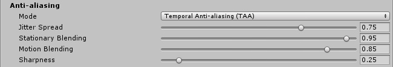

# Anti-aliasing

The **Anti-aliasing** effect gives graphics a smoother appearance. The Anti-aliasing algorithms are image-based, which is useful when support for traditional multisampling is not available, such as the [deferred rendering](https://docs.unity3d.com/Manual/RenderTech-DeferredShading.html) shading path, or **HDR** in the **forward rendering path** in Unity 5.5 or earlier. The Editor’s [Quality settings](https://docs.unity3d.com/Manual/class-QualitySettings.html) window is home to these options. 

For further information on the **Anti-aliasing** effect, see the [Anti-aliasing](https://docs.unity3d.com/Manual/PostProcessing-Antialiasing.html) documentation in the Unity manual.

The algorithms available in the post-processing stack are:

- **Fast Approximate Anti-aliasing (FXAA)**; a fast algorithm for mobile and platforms that don’t support motion vectors.
- **Subpixel Morphological Anti-aliasing (SMAA)**; a high-quality but slower algorithm for mobile and platforms that don’t support motion vectors. 
- **Temporal Anti-aliasing (TAA)**; an advanced technique which requires motion vectors. Ideal for desktop and console platforms.

They are set per-camera in the **Post-process Layer** component.

## Fast Approximate Anti-aliasing (FXAA)

**FXAA** is the most efficent technique and is recommended for mobile and other platforms that don’t support motion vectors, which are required for **Temporal Anti-aliasing**.

### Properties

| Property   | Function                                                     |
| :--------- | :----------------------------------------------------------- |
| Fast Mode  | Enable this checkbox for a lower quality but faster variant of FXAA. Recommended for mobile platforms. |
| Keep Alpha | Enable this checkbox if you need to keep the alpha channel untouched by post-processing. If disabled, Unity will use the alpha channel to store internal data used to speed up and improve visual quality. |

### Performance

Enable `Fast Mode` if you are developing for mobile or Nintendo Switch to get a performance boost. It will also provide a small boost for PlayStation 4 and Xbox One development. `Fast Mode` does not provide any extra benefits for desktop GPUs; regular mode should be used for added visual quality.

### Requirements

- Shader Model 3

See the [Graphics Hardware Capabilities and Emulation](https://docs.unity3d.com/Manual/GraphicsEmulation.html) page for further details and a list of compliant hardware.

## Subpixel Morphological Anti-aliasing (SMAA)

**SMAA** is a higher quality anti-aliasing effect than **FXAA** but it's also slower. Depending on the art-style of your game it can work as well as **Temporal Anti-aliasing** while avoiding some of the shortcomings of this technique.

### Properties

| Property | Function                                         |
| :-------- | :------------------------------------------------ |
| Quality  | Set the overall quality of the anti-aliasing filter. |

### Performance

Lowering the `Quality` setting makes the effect run faster. Do not use **SMAA** on mobile platforms.

### Known issues and limitations

- SMAA doesn't support AR/VR.

### Requirements

- Shader Model 3

See the [Graphics Hardware Capabilities and Emulation](https://docs.unity3d.com/Manual/GraphicsEmulation.html) page for further details and a list of compliant hardware.

## Temporal Anti-aliasing

**TAA** is an advanced anti-aliasing technique where frames are accumulated over time in a history buffer to be used to smooth edges more effectively. It is substantially better at smoothing edges in motion but requires motion vectors and is more expensive than **FXAA**. It is ideal for desktop and console platforms.

### Properties

| Property            | Function                                                     |
| :------------------- | :------------------------------------------------------------ |
| Jitter Spread       | Set the diameter (in texels) in which jitter samples are spread. Smaller values result in crisper but a more aliased output. Larger values result in more stable but blurrier output. |
| Stationary Blending | Set the blend coefficient for stationary fragments. This setting controls the percentage of history sample blended into final color for fragments with minimal active motion. |
| Motion Blending     | Set the blending coefficient for moving fragments. This setting controls the percentage of history sample blended into the final color for fragments with significant active motion. |
| Sharpness           | Set the sharpneess to alleviate the slight loss of details in high frequency regions which can be caused by TAA. |

### Known issues and limitations

- Not supported on GLES2 platforms.

### Requirements

- Motion vectors
- Depth texture
- Shader Model 3

See the [Graphics Hardware Capabilities and Emulation](https://docs.unity3d.com/Manual/GraphicsEmulation.html) page for further details and a list of compliant hardware.
