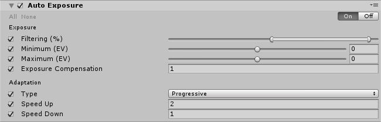

# Auto Exposure

The **Auto Exposure** effect dynamically adjusts the exposure of an image according to the range of brightness levels the image contains. 

For more information on the **Auto Exposure** effect and its use in Unity, see the [Auto Exposure](https://docs.unity3d.com/Manual/PostProcessing-AutoExposure.html) documentation in the Unity manual.

In Unity, this effect generates a histogram on every frame and filters it to find the average luminance value. This histogram and the **Auto Exposure** effect requires [Compute shader](https://docs.unity3d.com/Manual/ComputeShaders.html) support.

### Properties

**Exposure** settings:

| Property              | Function                                                     |
| :--------------------- | :------------------------------------------------------------ |
| Filtering             | Set the lower and upper percentages of the histogram that find a stable average luminance. Values outside of this range will be discarded and won't contribute to the average luminance. |
| Minimum               | Set the minimum average luminance to consider for auto exposure in EV. |
| Maximum               | Set the maximum average luminance to consider for auto exposure in EV. |
| Exposure Compensation | Set the middle-grey value to compensate the global exposure of the scene. |

**Adaptation** settings:

| Property   | Function                                                     |
| :---------- | :------------------------------------------------------------ |
| Type       | Select the Adaptation type. **Progressive** animates the Auto Exposure. **Fixed** does not animate the Auto Exposure. |
| Speed Up   | Set the Adaptation speed from a dark to a light environment.         |
| Speed Down | Set the Adaptation speed from a light to a dark environment.         |

### Details

Use the `Filtering` range to exclude the darkest and brightest part of the image so that very dark and very bright pixels do not contribute to the average luminance. Values are in percent.

`Minimum`/`Maximum` values clamp the computed average luminance into a given range.

You can set the `Type` to `Fixed` and it will behave like an auto-exposure setting.

Use the **Light Meter** [monitor](https://github.com/Unity-Technologies/PostProcessing/wiki/Debugging) when setting up this effect.

### Requirements

- Compute shader
- Shader model 5

See the [Graphics Hardware Capabilities and Emulation](https://docs.unity3d.com/Manual/GraphicsEmulation.html) page for further details and a list of compliant hardware.
