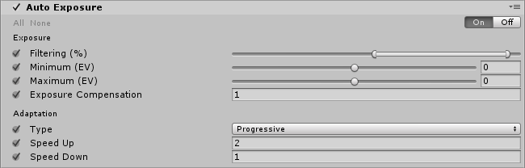

In ocular physiology, adaptation is the ability of the eye to adjust to various levels of darkness and light. The human eye can function from very dark to very bright levels of light. However, in any given moment of time, the eye can only sense a contrast ratio of roughly one millionth of the total range. What enables the wider reach is that the eye adapts its definition of what is black.

This effect dynamically adjusts the exposure of the image according to the range of brightness levels it contains. The adjustment takes place gradually over a period of time, so the player can be briefly dazzled by bright outdoor light when, say, emerging from a dark tunnel. Equally, when moving from a bright scene to a dark one, the “eye” takes some time to adjust.

Internally, this effect generates a histogram on every frame and filters it to find the average luminance value. This histogram, and as such the effect, requires [Compute shader](https://docs.unity3d.com/Manual/ComputeShaders.html) support.

> **TODO:** before/after screenshot

### Properties

**Exposure** settings:

| Property              | Function                                                     |
| :--------------------- | :------------------------------------------------------------ |
| Filtering             | These values are the lower and upper percentages of the histogram that will be used to find a stable average luminance. Values outside of this range will be discarded and wont contribute to the average luminance. |
| Minimum               | Minimum average luminance to consider for auto exposure (in EV). |
| Maximum               | Maximum average luminance to consider for auto exposure (in EV). |
| Exposure Compensation | Middle-grey value. Use this to compensate the global exposure of the scene. |

**Adaptation** settings:

| Property   | Function                                                     |
| :---------- | :------------------------------------------------------------ |
| Type       | Use Progressive if you want the auto exposure to be animated. Use Fixed otherwise. |
| Speed Up   | Adaptation speed from a dark to a light environment.         |
| Speed Down | Adaptation speed from a light to a dark environment.         |

### Details

Use the `Filtering` range to exclude the darkest and brightest part of the image. To compute an average luminance you generally don’t want very dark and very bright pixels to contribute too much to the result. Values are in percent.

`Minimum`/`Maximum` values clamp the computed average luminance into a given range.

You can also set the `Type` to `Fixed` if you don’t need the eye adaptation effect and it will behave like an auto-exposure setting.

It is recommended to use the **Light Meter** [monitor](https://github.com/Unity-Technologies/PostProcessing/wiki/Debugging) when setting up this effect.

### Requirements

- Compute shader
- Shader model 5

See the [Graphics Hardware Capabilities and Emulation](https://docs.unity3d.com/Manual/GraphicsEmulation.html) page for further details and a list of compliant hardware.