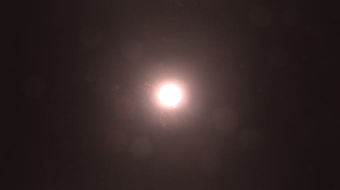

# Bloom

**Bloom** is an effect used to reproduce an imaging artifact of real-world cameras. The effect produces fringes of light extending from the borders of bright areas in an image, contributing to the illusion of an extremely bright light overwhelming the camera or eye capturing the scene.

**Lens Dirt** applies a fullscreen layer of smudges or dust to diffract the Bloom effect. This is commonly used in modern first person shooters.

### Properties

**Bloom** settings:

| Property         | Function                                                     |
| :---------------- | :------------------------------------------------------------ |
| Intensity        | Strength of the Bloom filter.                                |
| Threshold        | Filters out pixels under this level of brightness. This value is expressed in gamma-space. |
| Soft Knee        | Makes transition between under/over-threshold gradual (0 = hard threshold, 1 = soft threshold). |
| Clamp            | Clamps pixels to control the bloom amount. This value is expressed in gamma-space. |
| Diffusion        | Changes extent of veiling effects in a screen resolution-independent fashion. |
| Anamorphic Ratio | Emulates the effect of an anamorphic lens by scaling the bloom vertically (in range [-1,0]) or horizontally (in range [0,1]). |
| Color            | Tint of the Bloom filter.                                    |
| Fast Mode        | Boost performances by lowering the effect quality.           |

**Dirtiness** settings:

| Property  | Function                                              |
| --------- | ----------------------------------------------------- |
| Texture   | Dirtiness texture to add smudges or dust to the lens. |
| Intensity | Amount of lens dirtiness.                             |

### Details

With properly exposed HDR scenes, `Threshold` should be set to ~1 so that only pixels with values above 1 leak into surrounding objects. You’ll probably want to drop this value when working in LDR or the effect won’t be visible.

### Performances

Lowering the `Diffusion` parameter will make the effect faster. The further away `Anamorphic Ratio` is from 0, the slower it will be. On mobile and low-end platforms it is recommended to enable `Fast Mode` as it gives a significant boost in performances.

Finally, smaller lens dirt textures will result is faster lookup and blending across volumes.

### Requirements

- Shader model 3

See the [Graphics Hardware Capabilities and Emulation](https://docs.unity3d.com/Manual/GraphicsEmulation.html) page for further details and a list of compliant hardware.