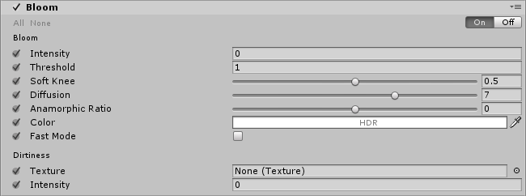

# Bloom

The **Bloom** effect makes bright areas in your image glow. To do this, it creates fringes of light that extend from bright areas in your image. This simulates the effect a real-world camera gives when light overwhelms the lens.

The Bloom effect also has a **Dirtiness** feature, which you can use to apply a full-screen layer of smudges or dust to diffract the Bloom effect.

### Properties

**Bloom** settings:

| Property         | Function                                                     |
| :---------------- | :------------------------------------------------------------ |
| Intensity        | Set the strength of the **Bloom** filter.                                |
| Threshold        | Set the level of brightness to filter out pixels under this level. This value is expressed in gamma-space. |
| Soft Knee        | Set the gradual threshold for transitions between under/over-threshold (0 = hard threshold, 1 = soft threshold). |
| Clamp            | Set the value for clamping pixels to control the **Bloom** amount. This value is expressed in gamma-space. |
| Diffusion        | Set the extent of veiling effects in a screen resolution-independent fashion. |
| Anamorphic Ratio | Set the ratio to scale the **Bloom** vertically (in range [-1,0]) or horizontally (in range [0,1]). This emulates the effect of an anamorphic lens. |
| Color            | Select the color of the tint of the **Bloom** filter.                                    |
| Fast Mode        | Enable this checkbox to boost performance by lowering the **Bloom** effect quality.           |

**Dirtiness** settings:

| Property  | Function                                              |
| --------- | ----------------------------------------------------- |
| Texture   | Select a Dirtiness texture to add smudges or dust to the lens. |
| Intensity | Set the amount of lens dirtiness.                             |

### Details

With properly exposed HDR scenes, the `Threshold` should be set to ~1 so that only pixels with values above 1 leak into surrounding objects. Lower this value when working in LDR or the Bloom effect won’t be visible.

### Performance

Lowering the `Diffusion` parameter will make the effect faster. The further away `Anamorphic Ratio` is from 0, the slower it will be. Enable `Fast Mode` if you are developing for mobile or low-end platforms to get a significant boost in performance.

Lower resolution lens dirt textures  result in faster lookup and blending across volumes.

### Requirements

- Shader model 3

