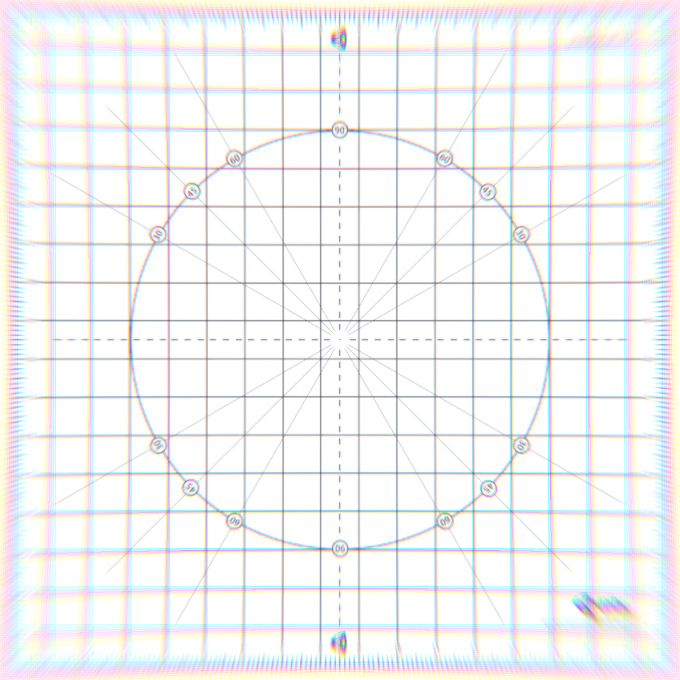

# Chromatic Aberration

In photography, chromatic aberration is an effect resulting from a camera’s lens failing to converge all colors to the same point. It appears as “fringes” of color along boundaries that separate dark and bright parts of the image.

The **Chromatic Aberration** effect is used to replicate this camera defect, it is also often used to artistic effect such as part of camera impact or intoxication effects. This implementation provides support for red/blue and green/purple fringing as well as user defined color fringing via an input texture.

### Properties

| Property     | Function                                                     |
| :------------ | :------------------------------------------------------------ |
| Spectral Lut | Texture used for custom fringing color (will use default when empty). |
| Intensity    | Strength of chromatic aberrations.                           |
| Fast Mode    | Use a faster variant of the effect for improved performances. |

### Details

**Chromatic Aberration** uses a `Spectral Lut` input for custom fringing. Four example spectral textures are provided in the repository:

- Red/Blue (Default)
- Blue/Red
- Green/Purple
- Purple/Green

You can create custom spectral textures in any image editing software. Their resolution is not constrained but it is recommended that they are as small as possible (such as the 3x1 textures provided).

You can achieve a less smooth effect by manually setting the `Filter Mode` of the input texture to `Point (no filter)`.

### Performances

Performances depend on the `Intensity` value (the higher it is, the slower the render will be as it will need more samples to render smooth chromatic aberrations).

Enabling `Fast Mode` is also recommended whenever possible as it's a lot faster, albeit not as smooth as the regular mode.

### Requirements

- Shader Model 3

See the [Graphics Hardware Capabilities and Emulation](https://docs.unity3d.com/Manual/GraphicsEmulation.html) page for further details and a list of compliant hardware.