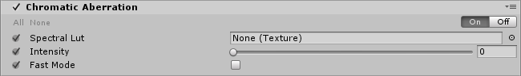

# Chromatic Aberration

The **Chromatic Aberration** effect splits color along boundaries in an image into their red, green, and blue channels. This reproduces the effect a real-world camera produces when light refracts and causes the wavelengths to disperse in the lens.

Unity provides support for red/blue and green/purple fringing. You can define fringing colors by using an input texture.

Scene without **Chromatic Aberration**.

Scene with **Chromatic Aberration**.

### Properties

| Property     | Function                                                     |
| :------------ | :------------------------------------------------------------ |
| Spectral Lut | Select the texture used for a custom fringing color. When left empty, Unity will use the default texture. |
| Intensity    | Set the strength of the **Chromatic Aberration** effect.                           |
| Fast Mode    | Use a faster variant of **Chromatic Aberration** effect for improved performance. |

### Details

**Chromatic Aberration** uses a `Spectral Lut` input for custom fringing. Four example spectral textures are provided in the repository:

- Red/Blue (Default)
- Blue/Red
- Green/Purple
- Purple/Green

You can create custom spectral textures in any image editing software. While the resolution size of spectral textures are not limited, small sizes like the 3x1 textures provided work best. 

You can achieve a rougher effect by manually setting the **Filter Mode** of the input texture to **Point (no filter)** in the [Texture Import Settings](https://docs.unity3d.com/Manual/class-TextureImporter.html) window.

### Performance

The performance of the **Chromatic Aberration** effect depends on its `Intensity` value. If the `Intensity` value is high, the render uses more samples to render smooth chromatic aberrations. This makes the process take more time.

**Fast Mode** is the quickest mode and recommended where possible. However, it's not as smooth as the regular mode.

### Requirements

- Shader Model 3
