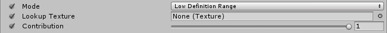
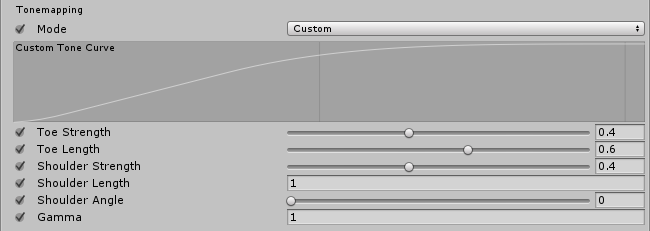
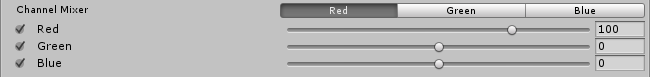

# Color Grading

The **Color Grading** effect alters or corrects the color and luminance of the final image that Unity produces. For more information on the **Color Grading** effect, see the Color Grading documentation in the Unity manual.

The **Color Grading** effect comes with three modes:

- **Low Definition Range (LDR):** ideal for lower-end platforms. Grading is applied to the final rendered frame clamped in a [0,1] range and stored in a standard LUT.
- **High Definition Range (HDR):** ideal for platforms that support HDR rendering. All color operations are applied in HDR and stored into a 3D log-encoded LUT to ensure a sufficient range coverage and precision (Alexa LogC El1000).
- **External:** for use with custom 3D LUTs authored in external software.

### Requirements

- Shader Model 3

See the [Graphics Hardware Capabilities and Emulation](https://docs.unity3d.com/Manual/GraphicsEmulation.html) page for further details and a list of compliant hardware.

## Global Settings

These settings are only available for **Low Definition Range** and **External** modes.

### Properties

| Property       | Function                                                     |
| :-------------- | :------------------------------------------------------------ |
| Lookup Texture | **LDR:** Select a custom lookup texture (strip format, e.g. 256x16) to apply before the rest of the color grading operators. If none is provided, a neutral one will be generated internally.  **External**: A custom 3D log-encoded texture.|
| Contribution   | **LDR:** Set how much of the lookup texture will contribute to the color grading. |

> **Note:** Volume blending between multiple LDR lookup textures is supported but only works correctly if they're the same size. For this reason it is recommended to stick to a single LUT size for the whole project (256x16 or 1024x32).

## Tonemapping

**Tonemapping** remaps the HDR values of an image into a range suitable to be displayed on screen. Always apply **Tonemapping** when using an HDR camera, otherwise values color intensities above 1 will be clamped at 1, altering the Scene's luminance balance.

### Properties

| Property          | Function                                                     |
| :----------------- | :------------------------------------------------------------ |
| Mode              | Only available in the **High Definition Range** mode. Select the Tonemapping mode from the dropdown menu.  **None**: No **Tonemapping** applied.  **Neutral**: Applies a range-remapping with minimal impact on color hue and saturation.   **ACES**: Applies a close approximation of the reference [ACES](http://www.oscars.org/science-technology/sci-tech-projects/aces) tonemapper for a cinematic look. This effect has more contrast than **Neutral** affects color hue and saturation. When this tonemapper is enabled, all grading operations are performed in the ACES color spaces for optimal precision and results.  **Custom**: A fully parametric tonemapper. This is the only tonemapper with its own settings.  |
| Toe Strength      | Set a value for the transition between the toe and the mid section of the curve. A value of 0 means no toe, a value of 1 means a very hard transition. |
| Toe Length        | Set the value for how much of the dynamic range is in the toe. With a small value, the toe will be very short and quickly transition into the linear section, and with a longer value having a longer toe. |
| Shoulder Strength | Set the value for the transition between the mid section and the shoulder of the curve. A value of 0 means no shoulder, value of 1 means a very hard transition. |
| Shoulder Length   | Set the value for how many F-stops (EV) to add to the dynamic range of the curve. |
| Shoulder Angle    | Set the value for how much overshot to add to the shoulder.            |
| Gamma             | Set the value for applying a gamma function to the curve.                       |

## White Balance

### Properties

| Property    | Function                                                     |
| :----------- | :------------------------------------------------------------ |
| Temperature | Set the white balance to a custom color temperature.        |
| Tint        | Set the white balance to compensate for a green or magenta tint. |

## Tone

### Properties

| Property      | Function                                                     |
| :------------- | :------------------------------------------------------------ |
| Post-exposure | Only available in the **High Definition Range** mode.  Set the value for the overall exposure of the scene in EV units. This is applied after HDR effect and right before tonemapping so it won’t affect previous effects in the chain. |
| Color Filter  | Select a color for the Tint of the render.                     |
| Hue Shift     | Adjust the hue of all colors.                                |
| Saturation    | Adjust the intensity of all colors.                          |
| Brightness    | Only available in the **Low Definition Range** mode.  Adjust the brightness of the image. **Note:**  |
| Contrast      | Adjust the overall range of tonal values.        |

## Channel Mixer

Use the **Channel Mixer** to modify the influence of each input color channel on the overall mix of the output channel. For example, increasing the influence of the green channel on the overall mix of the red channel will adjust all areas of the image containing green (including neutral/monochrome) to become more reddish in hue.

### Properties

| Property | Function                                                     |
| :-------- | :------------------------------------------------------------ |
| Channel  | Select the output channel to modify.                        |
| Red      | Adjust the influence of the red channel within the overall mix. |
| Green    | Adjust the influence of the green channel within the overall mix. |
| Blue     | Adjust the influence of the blue channel within the overall mix. |

## Trackballs

Use **Trackballs** to perform three-way color grading. Adjust the position of the point on the trackball to shift the hue of the image towards that color in the given tonal range. Different trackballs are used to affect different ranges within the image. Adjust the slider under the trackball to offset the color lightness of that range.

> **Note:** you can right-click a trackball to reset it to its default value. To change the trackball's sensitivity go to  `Edit -> Preferences -> PostProcessing`.

### Properties

| Property | Function                             |
| :-------- | :------------------------------------ |
| Lift     | Adjust the dark tones (or shadows). |
| Gamma    | Adjust the mid-tones.               |
| Gain     | Adjust the highlights.              |

## Grading Curves

**Grading Curves** are an advanced way to adjust specific ranges in hue, saturation or luminosity in your image. Adjust the curves on the eight available graphs to replace specific hues, desaturate luminosities and more.

### YRGB Curves

**YRGB Curves** are only available in the **Low Definition Range** mode. These curves, also called `Master`, `Red`, `Green` and `Blue` affect the selected input channel's intensity across the whole image. The X axis of the graph represents input intensity and the Y axis represents output intensity for the selected channel. Use these curves to adjust the appearance of attributes such as contrast and brightness.

### Hue vs Hue

Use **Hue vs Hue** to shift hues within specific ranges. This curve shifts the input hue (X axis) according to the output hue (Y axis). Use this setting to fine tune hues of specific ranges or perform color replacement.

### Hue vs Sat

Use **Hue vs Sat** to adjust the saturation of hues within specific ranges. This curve adjusts saturation (Y axis) according to the input hue (X axis). Use this setting to tone down particularly bright areas or create artistic effects.

### Sat vs Sat

Use **Sat vs Sat** to adjust the saturation of areas of certain saturation. This curve adjusts saturation (Y axis) according to the input saturation (X axis). Use this setting to fine tune saturation adjustments made with settings from the [**Tone**](#tone) section.

### Lum vs Sat

Use **Lum vs Sat** to adjust the saturation of areas of certain luminance. This curve adjusts saturation (Y axis) according to the input luminance (X axis). use this setting to desaturate areas of darkness to provide an interesting visual contrast.

