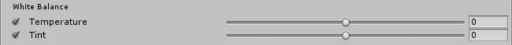

Color grading is the process of altering or correcting the color and luminance of the final image. You can think of it like applying filters in software like Instagram.

> **TODO:** before/after screenshot

The **Color Grading** effect comes with three modes:

- **Low Definition Range:** this mode is aimed at lower-end platforms but it can be used on any platform. Grading is applied to the final rendered frame clamped in a [0,1] range and stored in a standard LUT.
- **High Definition Range:** this mode is aimed at platforms that support HDR rendering. All the color operations will be applied in HDR and stored into a 3D log-encoded LUT to ensure a sufficient range coverage and precision (Alexa LogC El1000).
- **External:** this mode allows you to provide a custom 3D LUT authored in an external software. **TODO:** tutorial

### Requirements

- Shader Model 3

See the [Graphics Hardware Capabilities and Emulation](https://docs.unity3d.com/Manual/GraphicsEmulation.html) page for further details and a list of compliant hardware.

## Global Settings

> **Note:** these are only available for the **Low Definition Range** and **External** modes.

### Properties

| Property       | Function                                                     |
| :-------------- | :------------------------------------------------------------ |
| Lookup Texture | **LDR:** A custom lookup texture (strip format, e.g. 256x16) to apply before the rest of the color grading operators. If none is provided, a neutral one will be generated internally. **External**: A custom 3D log-encoded texture. **TODO:** tutorial |
| Contribution   | **LDR:** How much of the lookup texture will contribute to the color grading. |

> **Note:** volume blending between multiple LDR lookup textures is supported but only works correctly if they're the same size. For this reason it is recommended to stick to a single LUT size for the whole project (256x16 or 1024x32).

## Tonemapping

Tonemapping is the process of remapping HDR values of an image into a range suitable to be displayed on screen. Tonemapping should always be applied when using an HDR camera, otherwise values color intensities above 1 will be clamped at 1, altering the scenes luminance balance.

The **High Definition Range** mode comes with 4 tonemapping operators:

- **None:** no tonemapping will be applied.
- **Neutral:** only does range-remapping with minimal impact on color hue & saturation and is generally a great starting point for extensive color grading.
- **ACES**: uses a close approximation of the reference [ACES](http://www.oscars.org/science-technology/sci-tech-projects/aces) tonemapper for a more filmic look. Because of that, it is more contrasted than **Neutral** and has an effect on actual color hue & saturation. Note that if you enable this tonemapper all the grading operations will be done in the ACES color spaces for optimal precision and results.
- **Custom:** a fully parametric tonemapper.

> **Note**: these are only available for the **High Definition Range** mode.

### Properties

> **Note**: **Custom** is the only tonemapper with settings.

| Property          | Function                                                     |
| :----------------- | :------------------------------------------------------------ |
| Toe Strength      | Affects the transition between the toe and the mid section of the curve. A value of 0 means no toe, a value of 1 means a very hard transition. |
| Toe Length        | Affects how much of the dynamic range is in the toe. With a small value, the toe will be very short and quickly transition into the linear section, and with a longer value having a longer toe. |
| Shoulder Strength | Affects the transition between the mid section and the shoulder of the curve. A value of 0 means no shoulder, value of 1 means a very hard transition. |
| Shoulder Length   | Affects how many F-stops (EV) to add to the dynamic range of the curve. |
| Shoulder Angle    | Affects how much overshot to add to the shoulder.            |
| Gamma             | Applies a gamma function to the curve.                       |

## White Balance

### Properties

| Property    | Function                                                     |
| :----------- | :------------------------------------------------------------ |
| Temperature | Sets the white balance to a custom color temperature.        |
| Tint        | Sets the white balance to compensate for a green or magenta tint. |

## Tone

### Properties

| Property      | Function                                                     |
| :------------- | :------------------------------------------------------------ |
| Post-exposure | Adjusts the overall exposure of the scene in EV units. This is applied after HDR effect and right before tonemapping so it won’t affect previous effects in the chain. **Note:** Only available with the **High Definition Range** mode. |
| Color Filter  | Tints the render by multiplying a color.                     |
| Hue Shift     | Shifts the hue of all colors.                                |
| Saturation    | Pushes the intensity of all colors.                          |
| Brightness    | Makes the image brighter or darker. **Note:** Only available with the **Low Definition Range** mode. |
| Contrast      | Expands or shrinks the overall range of tonal values.        |

## Channel Mixer

This is used to modify the influence of each input color channel on the overall mix of the output channel. For example, increasing the influence of the green channel on the overall mix of the red channel will adjust all areas of the image containing green (including neutral/monochrome) to become more reddish in hue.

### Properties

| Property | Function                                                     |
| :-------- | :------------------------------------------------------------ |
| Channel  | Selects the output channel to modify.                        |
| Red      | Modifies the influence of the red channel within the overall mix. |
| Green    | Modifies the influence of the green channel within the overall mix. |
| Blue     | Modifies the influence of the blue channel within the overall mix. |

## Trackballs

The trackballs are used to perform three-way color grading. Adjusting the position of the point on the trackball will have the effect of shifting the hue of the image towards that color in the given tonal range. Different trackballs are used to affect different ranges within the image. Adjusting the slider under the trackball offsets the color lightness of that range.

> **Note:** you can right-click a trackball to reset it to its default value. You can also change the trackballs sensitivity by going to `Edit -> Preferences -> PostProcessing`.

### Properties

| Property | Function                             |
| :-------- | :------------------------------------ |
| Lift     | Adjusts the dark tones (or shadows). |
| Gamma    | Adjusts the mid-tones.               |
| Gain     | Adjusts the highlights.              |

## Grading Curves

Grading curves are an advanced way to adjust specific ranges in hue, saturation or luminosity in your image. By adjusting the curves on the eight available graphs you can achieve the effects of specific hue replacement, desaturating certain luminosities and much more.

### YRGB Curves

These curves, also called `Master`, `Red`, `Green` and `Blue` affect the selected input channels intensity across the whole image. The X axis of the graph represents input intensity and the Y axis represents output intensity for the selected channel. This can be used to further adjust the appearance of basic attributes such as contrast and brightness.

>  **Note:** these curves are only available with the **Low Definition Range** mode.

### Hue vs Hue

Used to shift hues within specific ranges. This curve shifts the input hue (X axis) according to the output hue (Y axis). This can be used to fine tune hues of specific ranges or perform color replacement.

### Hue vs Sat

Used to adjust saturation of hues within specific ranges. This curve adjusts saturation (Y axis) according to the input hue (X axis). This can be used to tone down particularly bright areas or create artistic effects such as monochromatic except a single dominant color.

### Sat vs Sat

Used to adjust saturation of areas of certain saturation. This curve adjusts saturation (Y axis) according to the input saturation (X axis). This can be used to fine tune saturation adjustments made with settings from the **Tone** section.

### Lum vs Sat

Used to adjust saturation of areas of certain luminance. This curve adjusts saturation (Y axis) according to the input luminance (X axis). This can be used to desaturate areas of darkness to provide an interesting visual contrast.

