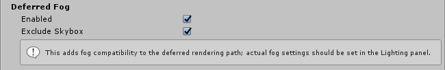

# Deferred Fog

The **Deferred Fog** effect simulates the look of fog or mist in outdoor environments. To do this, it overlays a color onto objects depending on how far away they are from the Camera.

 

You can also use the Deferred fog effect to hide object clipping. This is useful if you want to bring the Camera’s far clip plane forward to improve performance.

The **Deferred Fog** effect creates a screen-space fog based on the camera’s [depth texture](https://docs.unity3d.com/Manual/SL-DepthTextures.html). It supports Linear, Exponential and Exponential Squared fog types. **Deferred Fog** settings are on the **Scene** tab of the [**Lighting window**](https://docs.unity3d.com/Manual/lighting-window.html) in **Window > Rendering > Lighting Settings**.

### Properties

| Property       | Function                          |
| :-------------- | :--------------------------------- |
| Enabled        | Enable this checkbox to turn the **Deferred Fog** effect on.|
| Exclude Skybox | Enable this checkbox to exclude fog from the [skybox](https://docs.unity3d.com/Manual/class-Skybox.html). |

### Details

The **Deferred Fog** effect only appears in your [**Post-process Layer**](https://docs.unity3d.com/Packages/com.unity.postprocessing@latest?subfolder=/manual/Quick-start.html#post-process-layer) if the camera is set to render with the [**Deferred rendering path**](https://docs.unity3d.com/Manual/RenderTech-DeferredShading.html). It is enabled by default and adds the support of **Deferred Fog** from the [**Lighting window**](https://docs.unity3d.com/Manual/lighting-window.html), which would otherwise only work with the [**Forward rendering path**](https://docs.unity3d.com/Manual/RenderTech-ForwardRendering.html).

### Requirements

- Depth texture
- Shader Model 3

