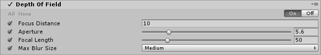

# Depth of Field

The **Depth of Field** effect blurs the background of your image while the objects in the foreground stay in focus. This simulates the focal properties of a real-world camera lens.

 

A real-world **camera** can focus sharply on an object at a specific distance. Objects nearer or farther from the **camera’s** focal point appear slightly out of focus or blurred. This blurring gives a visual cue about an object’s distance, and introduces “bokeh” which refers to visual artifacts that appear around bright areas of the image as they fall out of focus.

### Properties

| Property       | Function                                                     |
| :-------------- | :------------------------------------------------------------ |
| Focus Distance | Set the distance to the point of focus.                              |
| Aperture       | Set the ratio of the aperture (known as f-stop or f-number). The smaller the value is, the shallower the depth of field is. |
| Focal Length   | Set the distance between the lens and the film. The larger the value is, the shallower the depth of field is. |
| Max Blur Size  | Select the convolution kernel size of the bokeh filter from the dropdown. This setting determines the maximum radius of bokeh. It also affects the performance. The larger the kernel is, the longer the GPU time is required. |

### Performance

The speed of the **Depth of Field** effect is tied to **Max Blur Size**. Only use a value higher than `Medium` if you are developing for desktop computers and, depending on the post-processing budget of your game, consoles. Use the lowest value when developing for mobile platforms.

### Requirements

- Depth texture
- Shader Model 3.5
