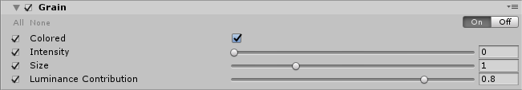

# Grain

The **Grain** effect overlays film noise onto your image. Film noise is the effect that real-world cameras produce when small particles in the camera’s film give the image a coarse, unprocessed effect.
Unity’s **Grain** effect is based on a coherent gradient noise. This gives your game a gritty effect that simulates the imperfections of film.

The **Grain** effect available in Unity is based on a coherent gradient noise. 

Scene without **Grain**.

Scene with **Grain**.

### Properties

| Property               | Function                                                     |
| :---------------------- | :------------------------------------------------------------ |
| Colored                | Enable the checkbox to use colored grain.                            |
| Intensity              | Set the value of the **Grain** strength. Higher values show more visible grain.             |
| Size                   | Set the value of the **Grain** particle size.                                         |
| Luminance Contribution | Set the value to control the noisiness response curve. This value is based on scene luminance. Lower values mean less noise in dark areas. |

### Performance

Disabling **Colored** makes the Grain effect run faster.

### Requirements

- Shader Model 3
