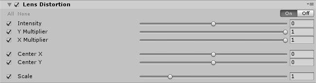

# Lens Distortion

The **Lens Distortion** effect simulates the shape of a real-world camera lens by distorting or undistorting the final rendered picture.

### Properties

| Property     | Function                                                     |
| :------------ | :------------------------------------------------------------ |
| Intensity    | Set the value for the total distortion amount.                                     |
| X Multiplier | Set the Intensity multiplier on X axis. Set it to 0 to disable distortion on this axis. |
| Y Multiplier | Set the Intensity multiplier on Y axis. Set it to 0 to disable distortion on this axis. |
| Center X     | Set the Distortion center point (X axis).                            |
| Center Y     | Set the Distortion center point (Y axis).                            |
| Scale        | Set the value for global screen scaling.                                       |

### Known issues and limitations

- Lens distortion doesn't support AR/VR.

### Requirements

- Shader Model 3

See the [Graphics Hardware Capabilities and Emulation](https://docs.unity3d.com/Manual/GraphicsEmulation.html) page for further details and a list of compliant hardware.
