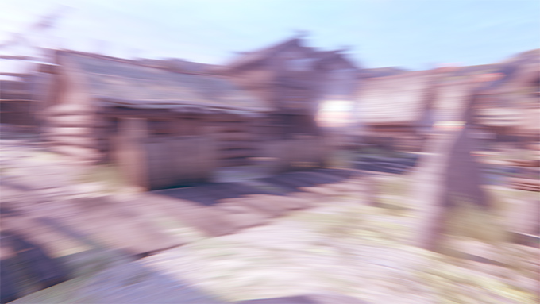
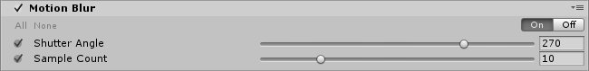

# Motion Blur

**Motion Blur** is a common post-processing effect that simulates the blurring of an image when objects filmed by a camera are moving faster than the camera’s exposure time. This can be caused by rapidly moving objects or a long exposure time. **Motion Blur** is used to subtle effect in most types of games but exaggerated in some genres, such as racing games.

 <em>Motion blur on a camera that rotates very fast</em>

### Properties

| Property      | Function                                                     |
| :------------- | :------------------------------------------------------------ |
| Shutter Angle | The angle of the rotary shutter. Larger values give longer exposure therefore a stronger blur effect. |
| Sample Count  | The amount of sample points, which affects quality and performances. |

### Performances

Using a lower `Sample Count` will lead to better performances.

### Known issues and limitations

- Motion blur doesn't support AR/VR.

### Requirements

- Motion vectors
- Depth texture
- Shader Model 3

See the [Graphics Hardware Capabilities and Emulation](https://docs.unity3d.com/Manual/GraphicsEmulation.html) page for further details and a list of compliant hardware.