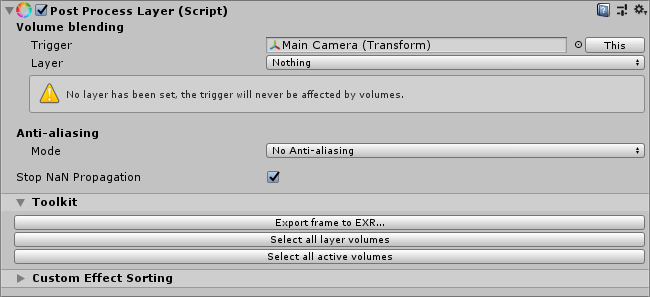
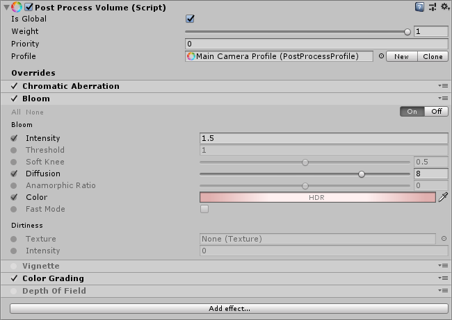

Getting started with post-processing

This page explains how to set up the components required to create post-processing effects in your scene. 

## Post-process Layer

To enable post-processing in your scene, add the **Rendering** > **Post Process Layer** component to the Main Camera GameObject. This component allows you to configure anti-aliasing for this post-process layer, choose which layer it will apply the post-processing to, and select the GameObject that triggers this post-process layer.

### Volume blending

You can use a Volume framework to manage post-processing effects in Unity. Each Volume can either be global or have local boundaries. They each contain scene setting property values that Unity interpolates between, depending on the position of the Camera, in order to calculate a final value.

Volumes can contain different combinations of Volume overrides. For example, one Volume can hold a Physically Based Sky Volume override, while other Volumes hold an Exponential Fog Volume override.

You can use local Volumes to change environment settings, such as fog color and density, to alter the mood of different areas of your Scene.

**Volume blending** assigns a trigger for a **Post-processing Layer** and controls which layer affects the Camera. 

| Property | Description                                                  |
| -------- | ------------------------------------------------------------ |
| Trigger  | This transform controls the volume blending feature. Unity assigns the Camera to the **Trigger** by default.   You can use other GameObjects to control the blending feature. For example, in a top-down game you might want to assign the player character GameObject to drive the blending instead of the Camera Transform.   When this field is set to None, it disables local volumes for this layer (global ones work normally). |
| Layer    | A mask of layers that Unity considers for volume blending. It allows you to control which layers affect the camera (volume filtering).    **Layer** also optimizes volume traversal, the update process of the volume system that blends parameters.   **Layer** is set to Nothing by default. It must have a layer assigned, otherwise volumes won’t take effect in your scene.  For best performance, keep your volumes in dedicated layers instead of the default one. For more information, see[ Layers](https://docs.unity3d.com/Manual/Layers.html). |

### Anti-aliasing

[**Anti-aliasing**](https://docs.unity3d.com/Packages/com.unity.postprocessing@latest?subfolder=/manual/Anti-aliasing.html) reduces the appearance of jagged edges in your scene..

The Post-process Layer component allows you to set up the anti-aliasing effect per-camera. You can use this to optimize the anti-aliasing in your scene. For example, you can enable [**Temporal Anti-aliasing (TAA)**](https://docs.unity3d.com/Packages/com.unity.postprocessing@latest?subfolder=/manual/Anti-aliasing#temporal-anti-aliasing.html) on your Main Camera, and a less resource-intensive form of anti-aliasing like [**Fast approximate anti-aliasing** **(FXAA)**](https://docs.unity3d.com/Packages/com.unity.postprocessing@latest?subfolder=/manual/Anti-aliasing#fast-approximate-anti-aliasing.html) on another camera.

You can use this setting to optimize your cameras to only use anti-aliasing when needed. 

| Property                  | Description                                                  |
| ------------------------- | ------------------------------------------------------------ |
| Mode                      | Select the type of anti-aliasing this component uses.        |
| Stop NaN propagation      | Destroys any pixels with positive or negative infinite values and pixels without any numeric data, known as Not a Number (NaN) pixels. It then replaces each pixel with a black color before Unity applies any post-processing effects. This avoids the presence of post-processing artifacts caused by broken data in the scene.    **Stop NaN propagation** can have a performance impact on some platforms. You should only enable it if you see post-processing artifacts as this setting does impact performance. |
| Directly to Camera Target | Builds the anti-aliasing result directly to the Camera’s target. This can help with performance. You might find this useful if you are targeting low-end hardware and post-processing is causing performance issues at runtime.    **Directly to Camera Target** is not compatible with older post-processing effects that use the `OnRenderImage` API. |

### Toolkit
The Toolkit section comes with a few utilities. 
| Property                        | Description                                                  |
| ------------------------------- | ------------------------------------------------------------ |
| Export the current frame to EXR | Supports the following modes: - **Full Frame (as displayed):** Exports the current frame of the Camera’s view. For example, if it is set to the Camera shown in the Game View, the export looks exactly like what is shown in the Game View. - **Disable post-processing:** Exports the current frame of the Camera’s view, without any post-processing applied. - **Break before Color Grading (linear):** Exports the current frame of the Camera’s view, but stops rendering just before **Color Grading** is applied. This is useful if you want to author grading LUTs in an external software. - **Break before Color Grading (log):** Exports the current frame of the Camera’s view and log-encodes the output. This is useful if you want to author full-precision HDR grading LUTs in an external software. |
| Select all layer volumes        | Selects all **Post-process Volume** components that can affect this **Post-process Layer**. |
| Select all active volumes       | Selects all **Post-process Volume** components currently affecting this **Post-process Layer**. |
### Custom Effect Sorting

**Custom Effect Sorting** allows you to change the rendering order of custom effects. Custom effects in your scene appear here in a reorderable list from first to last. You can drag and drop each setting to change their order.

For more information on custom effects, see [Writing Custom Effects](https://docs.unity3d.com/Packages/com.unity.postprocessing@latest?subfolder=/manual/Writing-Custom-Effects.html).
## Post Process Volume

The Post-process Volume component allows you to control the priority and blending of each local and global volume. You can also create a set of effect overrides to automatically blend post-processing settings in your scene. 

For example, if you have a global light vignette effect, you could control the **Intensity** setting of the vignette when the player enters a cave to make it darker, while the other post-processing settings are unchanged.

You can add the **Post Process Volume** component to any GameObject, including the Main Camera GameObject. However, the optimal way to use this component is to create a dedicated GameObject for each volume. To do this: 

- Create an empty GameObject.
- Add the **Post-process Volume** component to your new GameObject in the Inspector. To do this, select **Add** **Component > Post-process Volume.**
- View your Main Camera’s Inspector, and in the Post-process Layer component, set **Layer** to the new GameObject you have just created.

The **Post Process Volume** component is empty by default. Each post-process volume has two modes:

- **Global:** A global volume has no boundaries and Unity applies it to the whole scene. You can have several of these in your scene.
- **Local:** A local volume needs a collider or trigger component attached to it to define its boundaries. Any type of 3D collider is suitable, but complex meshes can be more resource-intensive. Local volumes have a **Blend Distance** property, which represents the outer distance from the volume surface where blending starts.

| **Property**   | **Description**                                              |
| -------------- | ------------------------------------------------------------ |
| Is Global      | Defines this volume as a Global volume.                      |
| Blend Distance | The outer distance from the volume surface where blending starts. You can only use this if **Is Global** is enabled. |
| Weight         | Reduces the global contribution of the volume and all its overrides.0 indicates no contribution and 1 indicates full contribution. |
| Priority       | Defines this volume’s order in the stack. The higher this number is, the higher this volume is placed in the stack. This means that Unity runs this volume before volumes in the stack that have a lower **Priority** number. |
| Profile        | Defines the profile for this volume. You can create a new profile using **New** or clone an existing profile. When you assign a profile to this field, the **Clone** button appears. You can use this to duplicate the assigned profile and assign it to this volume. |

## Adding post-processing effects to the stack
Once you have assigned a post-processing profile to the **Post Process Volume** component, you can add post-processing effects to the stack. To do this, select **Add effect** and choose the post-processing effect you want to use from the drop-down list. The Post Process Volume component displays all applied post-processing effects, and their properties, in a list at the bottom of the component’s Inspector.

The Post Process Volume component displays the following settings for each post-processing effect in the list:

A. Effect overrides toggle (checkbox): This checkbox toggles all overrides for this effect in this particular volume, but preserves your override selections when you disable and re-enable it.

B. Effect name: Right-click an effect name to show a quick-action menu to copy, paste, remove, or reset settings.

C. Effect toggle: Select the **On** or **Off** buttons to toggle an effect within this volume. This is useful if you want to manually disable an effect in this volume that is enabled globally or in a higher priority volume.

D. Property override toggle (checkbox): Enable this override checkbox to edit an individual setting. You can also quickly toggle all property overrides on or off with the small **All** and **None** shortcuts below the effect title. 