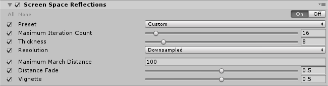

# Screen Space Reflections 

The **Screen Space Reflection** effect creates subtle reflections that simulate wet floor surfaces or puddles. It reflects both static and dynamic GameObjects to create realistic reflections.

Screen Space Reflection replaces specular highlights on a surface, which makes it an ideal effect to limit the amount of [specular light](https://docs.unity3d.com/Manual/shader-NormalSpecular.html) leaking.

Scene with Screen Space Reflections.

### Properties

| Property                | Function                                                     |
| :----------------------- | :------------------------------------------------------------ |
| Preset                  | Select the quality preset from the dropdown. Use **Custom** to fine tune the quality. |
| Maximum Iteration Count (`Custom` preset only) | Set the maximum number of steps in the raymarching pass. A higher value creates more reflections. |
| Thickness (`Custom` preset only)| Set the value of the ray thickness. A lower value detects smaller details but it is resource-intensive. |
| Resolution (`Custom` preset only)| Select the size of the internal buffer. Select **Downsample** to maximize performance. **Supersample** is slower but produces higher quality results. |
| Maximum March Distance  | Set the maximum distance to draw reflections in the scene. |
| Distance Fade           | Set the value for the distance to fade reflections close to the near plane. This is useful to hide common artifacts. |
| Vignette                | Set the value to fade the reflections close to the screen edges. |

### Performance

The `Custom` preset is very resource-intensive and best for beauty shots. If you are developing for consoles, use **Medium** as the maximum, unless you have plenty of GPU time to spare. On lower resolutions you can boost the quality preset and get similar timings with a higher visual quality.

### Known issues and limitations

- Screen-space reflections doesn't support AR/VR.

### Requirements

- Compute shader
- Motion vectors
- Deferred rendering path
- Shader Model 5.0
