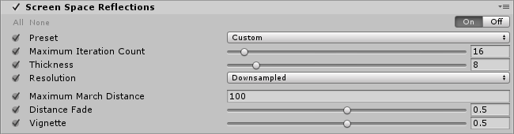

**Screen-space Reflection** is a technique for reusing screen-space data to calculate reflections. It is commonly used to create more subtle reflections such as on wet floor surfaces or in puddles. Because it fully works in screen-space it can only reflect what's currently on the screen (no backface reflection, no object living outside of the screen).

**Screen-space Reflection** is an expensive technique, but when used correctly can give great results. It is only available in the [deferred rendering path](https://docs.unity3d.com/Manual/RenderTech-DeferredShading.html) as it relies on the Normals G-Buffer.

The current implementation of **Screen-space reflections** in Unity is tuned for performance over quality to make it usable in production on current-gen consoles and desktop computers. Be aware that this technique isn't meant to be used to get perfectly smooth reflections, you should use probes or planar reflections of that. This effect is also great at acting as a specular occlusion effect by limiting the amount of specular light leaking.

> **TODO:** before/after screenshot

### Properties

| Property                | Function                                                     |
| :----------------------- | :------------------------------------------------------------ |
| Preset                  | Quality presets. Use `Custom` if you want to fine tune it.   |
| Maximum Iteration Count | Maximum number of steps in the raymarching pass. Higher values mean more reflections. **Note:** only available with the `Custom` preset. |
| Thickness               | Ray thickness. Lower values are more expensive but allow the effect to detect smaller details. **Note:** only available with the `Custom` preset. |
| Resolution              | Changes the size of the internal buffer. Downsample it to maximize performances or supersample it to get slow but higher quality results. **Note:** only available with the `Custom` preset. |
| Maximum March Distance  | Maximum distance to traverse in the scene after which it will stop drawing reflections. |
| Distance Fade           | Fades reflections close to the near plane. This is useful to hide common artifacts. |
| Vignette                | Fades reflections close to the screen edges.                 |

### Performances

You should only use the `Custom` preset for beauty shots. On consoles, don't go higher than `Medium` unless you have plenty of GPU time to spare, especially when working at full-hd resolutions. On lower resolutions you can boost the quality preset and get similar timings with a higher visual quality.

### Known issues and limitations

- Screen-space reflections doesn't support AR/VR.

### Requirements

- Compute shader
- Motion vectors
- Deferred rendering path
- Shader Model 5.0

See the [Graphics Hardware Capabilities and Emulation](https://docs.unity3d.com/Manual/GraphicsEmulation.html) page for further details and a list of compliant hardware.