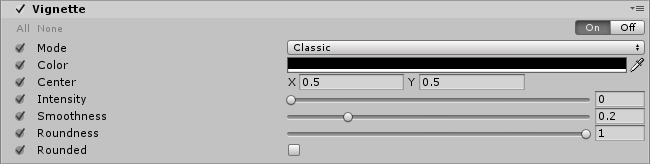
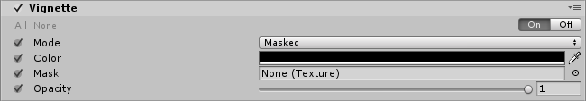

# Vignette

The **Vignette** effect darkens the edges of an image, leaving the center of the image brighter. For more information on the Vignette effect, see the [Vignette](https://docs.unity3d.com/Manual/PostProcessing-Vignette.html) documentation in the Unity manual.

The Vignette effect in the post-processing stack has two modes:

- [Classic](#classic)
- [Masked](#masked)

## Classic

Classic mode has parametric controls for the position, shape and intensity of the Vignette. This is the most common way to use the effect.

### Properties

| Property   | Function                                                 |
| :-------------- | :------------------------------------------------------------ |
| Color      | Set the color of the Vignette.      |
| Center     | Set the Vignette center point (screen center is [0.5,0.5]). |
| Intensity  | Set the amount of vignetting on screen.                              |
| Smoothness | Set the smoothness of the Vignette borders.                          |
| Roundness  | Set the value to round the Vignette. Lower values will make a more squared vignette.              |
| Rounded    | Enable this checkbox to make the vignette perfectly round. When disable, the Vignette effect is dependent on the current aspect ratio. |

## Masked

Masked mode multiplies a custom texture mask over the screen to create a Vignette effect. This mode can be used to achieve less common or irregular vignetting effects.

### Properties

| Property  | Function                                            |
| :------------- | :------------------------------------------------------- |
| Color     | Set the color of the Vignette. Use the alpha channel for transparency. |
| Mask      | Select a black and white mask to use as a vignette.            |
| Intensity | Set the mask opacity value.                                           |

### Requirements

- Shader Model 3

See the [Graphics Hardware Capabilities and Emulation](https://docs.unity3d.com/Manual/GraphicsEmulation.html) page for further details and a list of compliant hardware.
