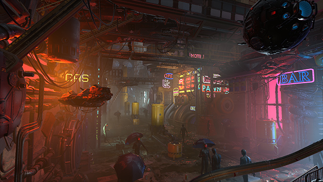

## Home

**Post-processing** is the process of applying full-screen filters and effects to a camera’s image buffer before it is displayed to screen. It can drastically improve the visuals of your product with little setup time.

You can use post-processing effects to simulate physical camera and film properties.

The images below demonstrate a scene with and without post-processing.

Without post-processing

With post-processing
